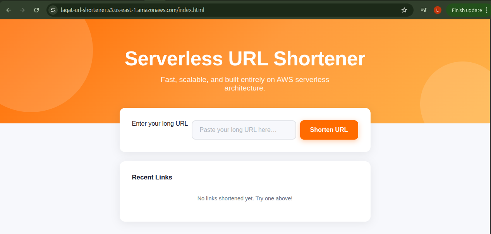
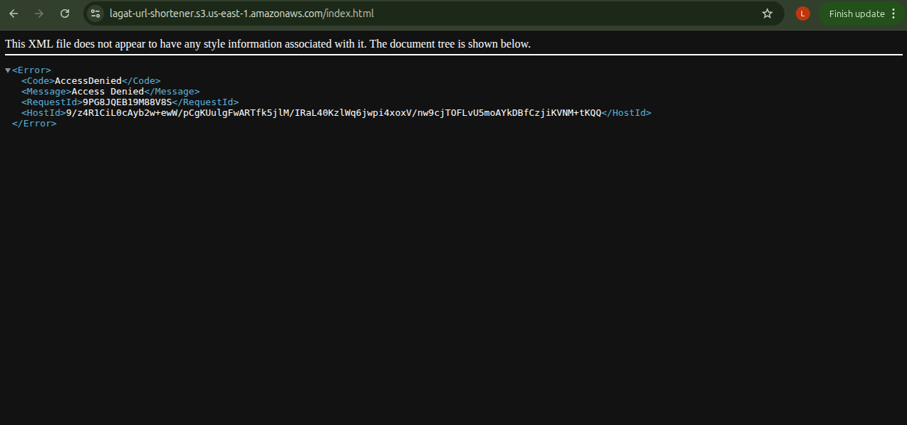

# 📘 AWS S3 LEARNING DOCUMENTATION 

# TL;DR

- Learning Outcomes!

✅ static website hosting

✅ object storage concepts

✅ bucket architecture

✅ frontend deployment

✅ public vs private permissions

✅ bucket policy importance

✅ cloud security defaults

✅ frontend/backend separation

## 🎯 Objective

- The goal of this project was to understand how Amazon S3 can be used to host a static frontend application in a serverless architecture.

- Instead of using a traditional web server, the frontend was deployed directly to an S3 bucket using Static Website Hosting.

## 🧠 First-Principles Understanding of S3

- Initially, I thought S3 was simply “cloud storage.”

- Through this project, I learned that S3 is actually: 

🌍 a massively scalable distributed object storage system designed for internet-scale applications.

📦 S3 stores objects instead of traditional hierarchical file systems.


🪣 Buckets act as global storage containers

⚡ AWS manages durability, replication, and scalability automatically

💻 I also learned that frontend applications consisting of (HTML, CSS, JavaScript) can be delivered directly from object storage without requiring a traditional application server.

## 🏗️ Architecture

```text
Browser
   ↓
S3 Bucket
   ↓
index.html
```

- The browser requests the frontend assets from S3, and the browser itself renders the application.

- This helped me understand:

static hosting architecture

frontend/backend separation

serverless frontend delivery

## ⚡ Key Concepts Learned

1. Buckets

Buckets are globally unique storage containers used to organize objects in S3.

2. Objects

Files uploaded into S3 become objects containing:

📦 data

🏷️ metadata

🔑 unique object keys

3. Static Website Hosting

S3 can expose frontend files publicly over HTTP, allowing it to function as a lightweight web hosting platform.

4. Public vs Private Access

- By default, S3 blocks public access for security reasons.

- I encountered an: 

🚫 AccessDenied - error when trying to access my uploaded site.

- This taught me:

🛡️ cloud security defaults matter

⚙️ permissions must be configured intentionally

📜 bucket policies control public accessibility

5. Bucket Policies

To make the frontend publicly accessible, I configured a bucket policy allowing:

```json
{
  "Version": "2012-10-17",
  "Statement": [
    {
      "Sid": "PublicReadGetObject",
      "Effect": "Allow",
      "Principal": "*",
      "Action": "s3:GetObject",
      "Resource": "arn:aws:s3:::YOUR-BUCKET-NAME-HERE/*"
    }
  ]
}
```

permissions for public users.

This was my first practical exposure to IAM-style access control concepts.

## 🌍 Real-World Relevance

This architecture is commonly used in modern cloud-native systems because it is:

📈 Scalable

💰 Low-cost

☁️ Serverless

⚙️ Operationally simple

Large companies use S3 heavily for:

🌐 Static website hosting

💾 Backups

🎥 Media storage

📊 Analytics pipelines

🏞️ Data lakes

## 📸 Deployment Outcome

✅ Successful Frontend Deployment



The frontend application was successfully served from an S3 bucket using Static Website Hosting.

AccessDenied Learning Moment



The AccessDenied error helped me understand:

🔐 S3 security defaults

🌍 Public access configuration

📜 Bucket policy importance

This became a valuable cloud security lesson rather than just an error.